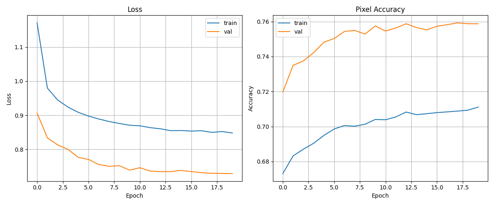
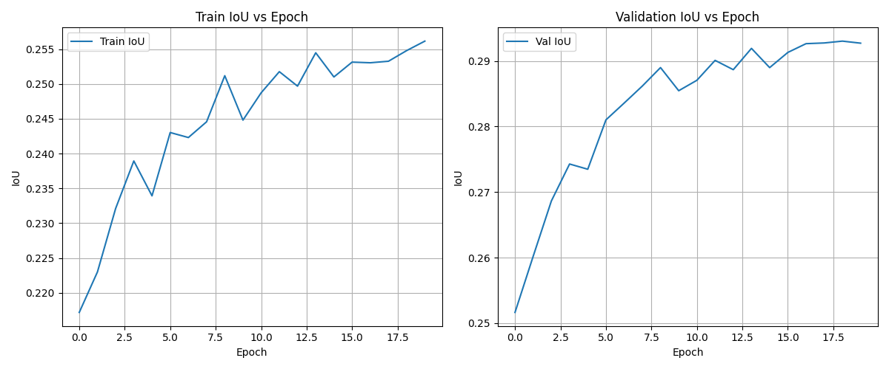
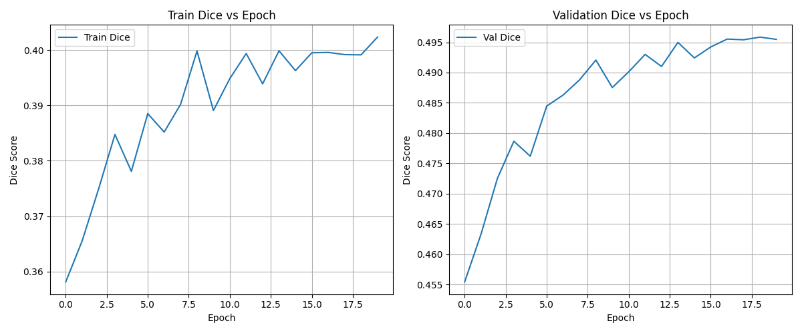
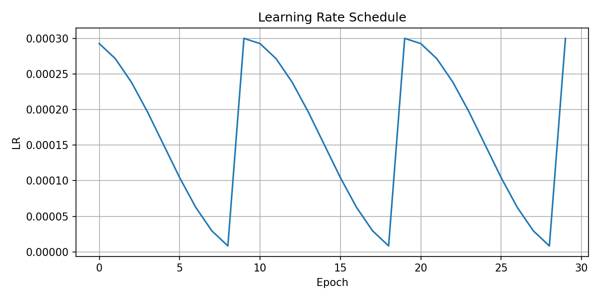

# 🚜 Off-Road Semantic Segmentation  
## DINOv2 + ConvNeXt-Style Segmentation Head

<p align="center">
  
  
  
  
  
</p>

---

# 📌 Abstract

We present a semantic segmentation system for off-road terrain scenes leveraging a frozen **DINOv2 (ViT-S/14)** backbone combined with a lightweight **ConvNeXt-style segmentation head**. The model performs multi-class pixel-wise classification across 10 terrain categories.  

Our approach achieves:

- **Mean IoU: 0.441**
- **Best Validation IoU: 0.460**
- **Pixel Accuracy: 0.822**

The method demonstrates strong performance on large structural classes while remaining computationally efficient.

---

# 🧠 Methodology

## Backbone: DINOv2

- Model: `dinov2_vits14`
- Patch size: 14
- Frozen during training
- Outputs patch tokens reshaped into spatial grid

## Segmentation Head

ConvNeXt-inspired architecture:

- 1×1 projection → 256 channels
- Depthwise separable convolution
- Residual connection
- Refinement block (128 channels)
- Dropout (p = 0.1)
- 1×1 classifier → 10 classes


# 📊 Quantitative Results

## Final Validation Metrics

| Metric | Value |
|--------|-------|
| **Mean IoU** | **0.4410** |
| **Best Val IoU** | **0.4603 (Epoch 29)** |
| Mean Dice | 0.6585 |
| Pixel Accuracy | 0.8224 |

---

## 📈 Per-Class IoU

| Class | IoU |
|--------|------|
| Background | 0.4569 |
| Trees | 0.5566 |
| Lush Bushes | 0.4325 |
| Dry Grass | 0.5677 |
| Dry Bushes | 0.3748 |
| Ground Clutter | 0.2031 |
| Logs | 0.1023 |
| Rocks | 0.2285 |
| Landscape | 0.5252 |
| Sky | 0.9622 |

---

## 📊 Training Curves

<p align="center">
  
</p>

---

## 📊 IoU & Dice Curves

<p align="center">
  
</p>

<p align="center">
  
</p>

---

## 📉 Learning Rate Schedule

<p align="center">
  
</p>

Cyclic learning rate (max = 3e-4, restart every 10 epochs) improves convergence stability.


# 📦 Installation

```bash
git clone https://github.com/your-username/offroad-segmentation.git
cd offroad-segmentation
pip install torch torchvision numpy matplotlib opencv-python pillow tqdm
```

DINOv2 downloads automatically via Torch Hub on first execution.

---

# 🗃 Dataset Structure

```
Offroad_Segmentation/
│
├── Color_Images/
└── Segmentation/
```

Mask raw pixel values:

```
0, 100, 200, 300, 500, 550, 700, 800, 7100, 10000
```

---

# 🚀 Training

```bash
python train_segmentation.py
```

Configuration:
- 30 epochs
- Frozen backbone
- Cyclic LR
- Cross-entropy loss

---

# 🧪 Evaluation

```bash
python test_segmentation_new.py \
    --model_path segmentation_head.pth \
    --data_dir Offroad_Segmentation_testImages \
    --output_dir predictions
```
# 📐 Evaluation Metrics

---

## 🔹 Intersection over Union (IoU)

```
                True Positives
IoU  =  ---------------------------------
        True Positives + False Positives + False Negatives
```

**Interpretation:**  
Measures the overlap between predicted segmentation and ground truth.  
Higher is better. Range: 0 → 1.

---

## 🔹 Dice Score (F1 Score for Segmentation)

```
                 2 × True Positives
Dice =  -----------------------------------------
        2 × True Positives + False Positives + False Negatives
```

**Interpretation:**  
More sensitive to small objects than IoU.  
Commonly used in medical and fine-grained segmentation tasks.

---

## 🔹 Pixel Accuracy

```
Pixel Accuracy = Correct Pixels / Total Pixels
```

**Interpretation:**  
Measures overall classification accuracy at the pixel level.  
⚠ Can be biased toward dominant classes (e.g., Sky).

---

## 🔍 Relationship Between IoU and Dice

```
Dice = (2 × IoU) / (1 + IoU)
IoU  = Dice / (2 − Dice)
```

Both metrics measure overlap, but Dice tends to produce slightly higher values.

# 🔍 Analysis

### Strengths
- Excellent Sky segmentation (IoU ≈ 0.96)
- Strong large-region consistency
- Stable training with no overfitting

### Weaknesses
- Logs and Rocks remain challenging
- Class imbalance impacts clutter categories

---

# 🔄 Reproducibility

To reproduce results:

- Same dataset split
- Same resize dimensions
- 30 epochs
- Frozen backbone
- Same cyclic LR schedule

Expected:
```
Mean IoU ≈ 0.46
```

---

